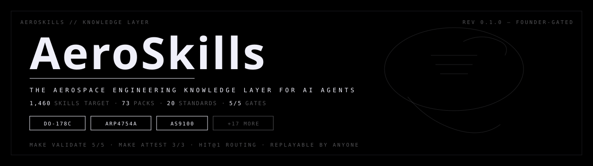
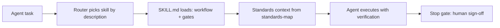

<p align="center">
  <picture>
    <source media="(prefers-color-scheme: dark)" srcset="docs/banner-dark.svg">
    
  </picture>
</p>

<p align="center">
  <strong>The aerospace knowledge layer for AI agents.</strong><br>
  Standards-mapped skills that give a coding agent the certification process — not just the acronyms.
</p>

<p align="center">
  <code>1,460 skills</code> · <code>73 domain packs</code> · <code>20 standards</code> · <code>5/5 REAL gates</code> · <code>Apache-2.0</code>
</p>

<p align="center">
  <a href="LICENSE"></a>
  <a href="https://agentskills.io"></a>
  <a href="docs/harness-contract.md"></a>
  <a href="STANDARDS.md"></a>
  <a href="skills/"></a>
</p>

<p align="center">
  <a href="#quick-start">Quick start</a> ·
  <a href="#for-humans">For humans</a> ·
  <a href="#for-agents">For agents</a> ·
  <a href="#the-standards-map">Standards map</a> ·
  <a href="#how-it-works">How it works</a> ·
  <a href="#roadmap">Roadmap</a> ·
  <a href="#faq">FAQ</a>
</p>

> **Note:** AeroSkills is currently a private development home, founder-gated for release. This README documents the release design. Skills follow the open [agentskills.io](https://agentskills.io) spec and install into **Claude Code, Codex, Gemini CLI, Cursor, GitHub Copilot, and 70+ more** agents.

---

Ask a general-purpose AI about DO-178C and you get a Wikipedia summary: the acronyms, none of the clauses. Aerospace engineering is standards-bound and evidence-driven. A number without a validation step is useless.

**AeroSkills encodes the process** — when to use a standard, the workflow, the pitfalls, and the point where the agent must stop and let a human sign. Each skill is a `SKILL.md` on the open agentskills.io format: YAML frontmatter the router reads, a body the agent follows. Loaded on demand, no lock-in, works in any host that reads the format.

## Quick start

**Install everything — one command, any agent:**

```bash
npx skills add arjun-0077/aeroskills
```

**Try one skill without installing:**

```bash
npx skills use arjun-0077/aeroskills --skill avionics/do178c/planning | claude
```

**Or copy a folder** — skills are just files:

```bash
git clone https://github.com/arjun-0077/aeroskills
cp -r aeroskills/skills/avionics/do178c/planning ~/.claude/skills/
```

**You know it worked when** your agent drafts a DO-178C verification plan with DAL allocation and a "stop — human sign-off required" gate, instead of a Wikipedia summary.

## For humans

### What's inside

**263 verified skills** (as of 2026-09-01) across **12 disciplines**, each spec-linted, behavior-tested, and router-asserted. Target: **73 packs × 20 skills = 1,460**.

| Family | Live packs | Standard spine | Example skills |
|---|---|---|---|
| **Avionics** | do178c, do254, do160, far-cs25, data-bus, flight-management | DO-178C, DO-254, DO-330, DO-160G | planning, verification, configuration-management, tool-qualification |
| **Aerodynamics** | airfoil, cfd, drag-polars, high-speed, boundary-layer, high-lift, ground-effects | NACA TR-824 | airfoil-selection, xfoil-analysis, cfd-convergence, normal-shock |
| **Systems engineering & safety** | arp4754a, arp4761a, mbse | ARP4754A, ARP4761A | dal-allocation, safety-assessment |
| **Flight mechanics** | performance, stability-control, handling-qualities | FAR-25/CS-25 | breguet-range, climb-performance, longitudinal-stability |
| **Flight test & operations** | envelope, performance, planning, flutter, stability | FAR-25/CS-25 | v-speeds, flight-test-planning, flutter-testing |
| **GNC & autonomy** | control, navigation, optimal-control, guidance, space | ARP4754A | root-locus-design, lqr-design, dymos-trajectory |
| **Space systems** | orbit-mechanics, adcs, subsystems, ecss | ECSS | orbital-decay, isa-atmosphere |
| **Structures** | fatigue, fem, composites, damage-tolerance, materials | FAR-25/CS-25 | engineering-margins |
| **Manufacturing quality** | as9100, as9102, ndt, special-processes | AS9100, AS9102 | first-article-inspection |
| **Propulsion** | rocket, turbofan, turboprop, ramjet, gas-turbine-cycle, axial-compressor, engine-airframe | FAR-33 | rocket-sizing |
| **Vehicle design** | conceptual, sizing, mass-properties, mdo, cost-estimation, structures-integration | FAR-25/CS-25 | — |
| **Cross-cutting** | sep2640, numerics, units-atmos, documentation, tolerancing | SEP-2640 | skill-delivery, engineering-report, unit-conversion |

Full catalog: the [skills/](skills/) tree — every leaf is a verified skill. Per-pack tables: [docs/catalog.md](docs/catalog.md).

### See a skill

This is the artifact — one real skill, exactly as agents receive it:

<details>
<summary><code>avionics/do178c/planning</code> — SKILL.md (excerpt)</summary>

```yaml
name: planning
description: >-
  Plans DO-178C software certification for airborne systems or equipment.
  Use when planning software certification: determine the software level
  (DAL A-E), the planning documents required, and the lifecycle data.
  Don't use for hardware (DO-254) or tool qualification (DO-330).
```

The body walks the agent through: software level determination → the
planning artifacts (PSAC, SDP, SVP, SCMP, SQAP) → the review gates →
**where the agent must stop and let a human sign**.

</details>

Every skill ships three things: a trigger-optimized description the router
reads, a step-by-step workflow with verification gates, and a **behavior
contract test** that runs offline. `make validate` checks all of it.

### The standards map

`standards-map.yaml` is the machine-readable source of truth; [STANDARDS.md](STANDARDS.md) is the human companion. **No other aerospace skills repo has this** — it is the moat:

| Standard | Domain | Status |
|---|---|---|
| DO-178C | Airborne software | gated, summary-not-copy |
| DO-254 | Airborne hardware | gated, summary-not-copy |
| DO-330 | Tool qualification | gated, summary-not-copy |
| DO-160G | Environmental qualification | gated, summary-not-copy |
| ARP4754A | Systems development | gated, summary-not-copy |
| ARP4761A | Safety assessment | gated, summary-not-copy |
| AS9100 | Quality management | gated, summary-not-copy |
| AS9102 | First article inspection | gated, summary-not-copy |
| MMPDS | Metallic materials data | gated, summary-not-copy |
| FAR-25 / CS-25 | Transport airworthiness | public |
| FAR-33 | Engine airworthiness | public |
| ARINC 429 | Avionics data bus | reference |
| NAS 410 | NDT personnel | reference |
| ASME Y14.5 | GD&T | reference |
| ECSS | Space engineering | public |
| NACA TR-824 / TN-902 | Aerodynamics | public |
| MIL-STD-1553 | Data bus | reference |
| SEP-2640 | Skill delivery format | open spec |

Gated standards never appear verbatim anywhere in this repository — the no-verbatim gate enforces it.

## For agents

### How it works



- **Discovery:** the router reads only the description (`what + when + trigger`) — loaded on demand, no context bloat
- **Determinism:** every skill's behavior contract runs offline; the router is deterministic
- **Proof:** `make validate` 5/5 + `make attest` 3/3, replayable by anyone
- **Format:** open agentskills.io spec, no lock-in, any host that reads the format

### Verify

You do not need to trust the badge. Replay the gates on the commit you are looking at:

| Gate | What it checks | How to run |
|---|---|---|
| 1 spec lint | agentskills.io conformance + compliance flags | `make lint-spec` |
| 2 desc lint | description what + when + trigger | `make desc-lint` |
| 3 behavior tests | per-skill behavior contract, DAL A–E determination | `make pytest-contract` |
| 4 no-verbatim | standards text copyright control | `make no-verbatim` |
| 5 Hit@1 corpus | router selects the expected skill (532 tasks) | `make hit1` |

```bash
make validate   # 5/5 REAL gates, deterministic, offline
make attest     # 3/3: number snapshot, brief audit, content-policy sweep
```

Verified means the full bar passes on the commit you are looking at. That is what "verified" means in this repository: nothing more. It is not certification, not approval, not airworthy.

## Roadmap

- **Shipped:** 263 verified skills across 12 disciplines, all gated by `make validate` (5/5) and `make attest` (3/3)
- **Release bar (founder, 2026-08-31):** 50+ domains × 20+ verified skills = 1,000+ skills before any release. The 12-discipline tree decomposes into 73 sub-domain packs (1,460 skills at 20 each). [development/50x20-domain-tree.md](development/50x20-domain-tree.md)
- **Next:** fill live packs toward 20 skills each; open remaining packs on the same eval-gated pipeline
- **Later:** reference builds; a SEP-2640-aligned MCP adapter; marketplace listings; AI Department Operator packs

## Contributing

Read [CONTRIBUTING.md](CONTRIBUTING.md) before opening a PR: one skill per PR, every contributor certifies their submission contains no controlled data and no verbatim standards text, every merge must pass `make validate` (5/5) and `make attest` (3/3).

## Security

Skills are folders that can carry scripts, and agent hosts execute what they load. Review the SKILL.md and any scripts before you install, the same way you would review any code dependency. Report vulnerabilities per [SECURITY.md](SECURITY.md).

## FAQ

[docs/FAQ.md](docs/FAQ.md) covers license, certification status, export control, what verified means, and affiliation. Short answers: Apache-2.0, not certified, not controlled as published, verified = replayable `make validate` 5/5 + `make attest` 3/3 on the commit you are looking at, not affiliated with RTCA, SAE, EASA, FAA, or any government.

<details>
<summary><b>Compliance notice</b></summary>

AeroSkills is an open, unrestricted library of *civil aerospace engineering methodology* for AI agents, published by Ashforde OU (Estonia) under Apache-2.0. The content is educational: general engineering principles, processes, and tool-usage guidance. It is **not** ITAR/EAR-controlled technical data, and no proprietary standards text is reproduced. Standards are referenced and summarized only (see [STANDARDS.md](STANDARDS.md)). As published, this library falls within the EU dual-use "public domain" exclusion (Annex I General Technology Note, Regulation (EU) 2021/821). Users are solely responsible for their own compliance. **Not affiliated with or endorsed by** RTCA, EUROCAE, SAE International, IAQG, EASA, FAA, or any government.

</details>

## License

Apache-2.0. See [LICENSE](LICENSE) · [NOTICE](NOTICE) · [SECURITY.md](SECURITY.md) · [CONTRIBUTING.md](CONTRIBUTING.md) · [STANDARDS.md](STANDARDS.md) · [CODE_OF_CONDUCT.md](CODE_OF_CONDUCT.md)

---

*If AeroSkills saves you an afternoon, star the repository — it tells us where to spend the next authoring pass.*
