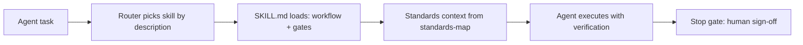

<p align="center">
  
</p>

<p align="center">
  
</p>

<p align="center">
  <strong>The aerospace knowledge layer for AI agents.</strong><br>
  Standards-mapped skills that give a coding agent the certification process — not just the acronyms.
</p>

<!-- gen:statline -->
<p align="center">
  
</p>
<!-- /gen:statline -->

<!-- gen:badges -->
<p align="center">
  <a href="skills/"></a>
  <a href="docs/DOMAINS.md"></a>
  <a href="docs/DOMAINS.md"></a>
  <a href="STANDARDS.md"></a>
  <a href="docs/harness-contract.md"></a>
  <a href="docs/harness-contract.md"></a>
  <a href="eval/"></a>
  <a href="https://agentskills.io"></a>
</p>
<p align="center">
  <a href="https://www.npmjs.com/package/aero-agent-skills"></a>
  <a href="packages/aero-agent-skills/"></a>
  <a href="docs/harness-integration.md"></a>
  <a href=".claude-plugin/"></a>
  <a href="packages/jetbrains-plugin/"></a>
</p>
<!-- /gen:badges -->

<p align="center">
  <a href="#from-free-skills-to-a-signed-evidence-pack">Evidence pilot</a> ·
  <a href="#quick-start">Quick start</a> ·
  <a href="#for-humans">For humans</a> ·
  <a href="#for-agents">For agents</a> ·
  <a href="#compatibility">Compatibility</a> ·
  <a href="#the-standards-map">Standards map</a> ·
  <a href="#how-it-works">How it works</a> ·
  <a href="#roadmap">Roadmap</a> ·
  <a href="#faq">FAQ</a>
</p>

> **Works everywhere:** skills follow the open [agentskills.io](https://agentskills.io) spec — any SKILL.md host can load them. Install and use in **Claude Code, OpenAI Codex, Gemini CLI, Cursor, OpenCode, DeepSeek (via harness), GitHub Copilot, Kimi, Cline/Roo, Continue**, and 70+ more — or connect over **MCP** (JetBrains AI Assistant / Junie, Claude Desktop, VS Code, Windsurf) via the `aero-agent-skills` npm package. Verified per-harness details: [docs/harness-integration.md](docs/harness-integration.md).

---

Ask a general-purpose AI about DO-178C and you get a Wikipedia summary: the acronyms, none of the clauses. Aerospace engineering is standards-bound and evidence-driven. A number without a validation step is useless.

**Aero Agent Skills encodes the process** — when to use a standard, the workflow, the pitfalls, and the point where the agent must stop and let a human sign. Each skill is a `SKILL.md` on the open agentskills.io format: YAML frontmatter the router reads, a body the agent follows. Loaded on demand, no lock-in, works in any host that reads the format.

The statline, the badges, the family table and the roadmap are **generated from the tree at HEAD** by `make visuals` — gate ratios included, read from the Makefile's own `validate:` and `attest:` lines — and `make visuals-check` fails CI when any block drifts. The prose outside those blocks is written by hand. A generated figure states a count; it does not state coverage, so where you need to know what a gate actually reaches and what it leaves untouched, [docs/harness-contract.md](docs/harness-contract.md) is the authority and every figure in it carries the command that produces it.

## Software product assurance under ECSS-Q-ST-80C

A software product assurance (PA) manager at a European space supplier owes the customer an answer to ECSS-Q-ST-80C Rev.2 (30 April 2025), the European Cooperation for Space Standardization (ECSS) standard for software product assurance, clause by clause, with the evidence behind each answer. These skills carry that work:

| Skill | What it does |
|---|---|
| [`q80-software-criticality-tailoring`](skills/space-systems/ecss/q80-software-criticality-tailoring/) | Places the software in criticality category A to D and works out which requirements apply, shrink or drop out for that category |
| [`q80-software-product-assurance-plan`](skills/space-systems/ecss/q80-software-product-assurance-plan/) | Grades the software product assurance (SPA) plan against its document requirements definition (DRD), and checks the organisation, supplier control and tools it describes |
| [`q80-software-process-assurance`](skills/space-systems/ecss/q80-software-process-assurance/) | Audits the process: life-cycle gates, handling of critical software, verification independence, reuse, generated code, nonconformances |
| [`q80-software-dependability-safety-analysis`](skills/space-systems/ecss/q80-software-dependability-safety-analysis/) | Grades the software failure modes and effects analysis, raises components that can bring down a more critical one, checks the hardware-software interaction analysis and proposes critical items |
| [`q80-software-security-assurance`](skills/space-systems/ecss/q80-software-security-assurance/) | Works the security-sensitivity dimension Revision 2 added: which components are sensitive, which clauses sensitivity switches on even at category D, the extra measures and when a change forces a regression run |
| [`q80-supplier-procurement-control`](skills/space-systems/ecss/q80-supplier-procurement-control/) | Checks supplier selection, what is flowed down to each supplier, supplier monitoring, procured and customer-furnished items and their receiving inspection |
| [`q80-software-configuration-nonconformance`](skills/space-systems/ecss/q80-software-configuration-nonconformance/) | Checks configuration management and each delivery's integrity value, and follows problem reports into nonconformances and the review board's disposition |
| [`q80-reuse-and-firmware-assurance`](skills/space-systems/ecss/q80-reuse-and-firmware-assurance/) | Builds the reuse file for heritage, commercial off-the-shelf and open-source software, checks licences, and checks programmed devices |
| [`q80-software-product-quality-metrics`](skills/space-systems/ecss/q80-software-product-quality-metrics/) | Sets quality thresholds per category and grades the measurements and the maturity trend against them |
| [`q80-milestone-assurance-evidence`](skills/space-systems/ecss/q80-milestone-assurance-evidence/) | Says which assurance evidence is due at the system requirements review (SRR), preliminary design review (PDR), critical design review (CDR), qualification review (QR) and acceptance review (AR), and builds the milestone report |
| [`q80-compliance-matrix`](skills/space-systems/ecss/q80-compliance-matrix/) | Joins the clause list to an evidence index and returns the matrix, the coverage and the gaps, always as a draft |

The role `software-product-assurance-engineer` in [Aero Agent Roles](https://github.com/ashfordeOU/aero-agent-roles) (published in the `aero-agent-roles` npm package) strings these skills into one clause-by-clause compliance matrix. It stops where each of them stops: at a named human's sign-off. Until that person signs, the matrix is a draft, not a statement of compliance.

## From free skills to a signed evidence pack

These skills, and the role that strings them into one matrix, are free under Apache-2.0 and stay that way. If you would rather have the ECSS-Q-ST-80C work run for you on your own evidence, Ashforde OÜ offers a **five-day evidence pilot**, delivered as a service on Aero Harness, the runtime Ashforde operates. It runs these same open-source skills and the `software-product-assurance-engineer` role over your criticality category, evidence table and document folder, and hands back a clause-by-clause draft compliance matrix, a gap list, a trace from each clause to your own files, and a signed record you can check offline without us. It stops where the skills stop, at your own sign-off: Ashforde never signs compliance on your behalf. Pricing on request.

**[See the pilot: ashforde.org/pilot](https://ashforde.org/pilot/)** · talk to us at [contact@ashforde.org](mailto:contact@ashforde.org)

## Quick start

**Every package Aero Agent Skills ships — pick the one that fits your host:**

| Package / channel | What it gives you | Get it |
|---|---|---|
| **npm CLI** `aero-agent-skills` | `list` · `search` · `show` · `install` (harness-aware) · `mcp` · `where` — one zero-dependency binary | `npm i -g aero-agent-skills` (aliases: `aero-skills`, `npx aero-skills`) |
| **MCP server** (same package) | `search_skills` (deterministic Hit@1 router) · `get_skill` · `list_skills` for any MCP host — Claude Desktop, VS Code, Cursor, Windsurf, Gemini CLI, JetBrains AI Assistant | add the JSON block below to your MCP config |
| **JetBrains plugin** | skill catalog tool window + **Copy MCP Config** / **Copy Registry URL** / **Docs & Harness Guide** actions inside the IDE | [Marketplace plugin 34041](https://plugins.jetbrains.com/plugin/34041-aero-agent-skills) → Settings → Plugins → `Aero Agent Skills` |
| **Claude Code plugin** | the twelve family routers load always-on (a few hundred tokens each), pull leaf skills on demand | `claude plugin marketplace add ashfordeOU/aero-agent-skills` |
| **agentskills.io format** | open spec — any SKILL.md host can load the library (Claude, Codex, Gemini, Cursor, OpenCode, DeepSeek, GitHub Copilot, Kimi, Cline/Roo, Continue, 70+) | `npx skills add ashfordeOU/aero-agent-skills` |
| **GitHub repo** | full source: skills, packs, standards map, docs | `git clone https://github.com/ashfordeOU/aero-agent-skills` |
| **Skill folders (any host)** | copy any skill folder into your harness — skills are files | `aero-skills install avionics/do178c --harness claude` or clone + `cp -r` |

**1 · Install everything — one command, any agent:**

```bash
npx skills add ashfordeOU/aero-agent-skills
```

**Try one skill without installing:**

```bash
npx skills use ashfordeOU/aero-agent-skills --skill avionics/do178c/planning | claude
```

**2 · Or the npm CLI** — list, search, show, install, and the MCP server in one zero-dependency binary:

```bash
npm i -g aero-agent-skills            # or: npx aero-agent-skills <command>
aero-skills search "draft a PSAC for a DAL B system"
aero-skills show avionics/do178c/planning
aero-skills install avionics/do178c --harness claude   # or: --harness codex|gemini|cursor|agents|opencode
```

Package: **[aero-agent-skills on npm](https://www.npmjs.com/package/aero-agent-skills)** (published by Ashforde OÜ).

**3 · Or install the JetBrains IDE plugin** (AI Assistant + Junie integration, searchable skill router in the IDE):

- Marketplace: **[Aero Agent Skills on the JetBrains Marketplace](https://plugins.jetbrains.com/plugin/34041-aero-agent-skills)**
- In the IDE: **Settings → Plugins → Marketplace** → search `Aero Agent Skills` → Install
- The plugin adds a tool window with the skill catalog, a **Copy MCP Server Config** action (one-click registration for AI Assistant / Junie — the MCP server then serves `search_skills` / `get_skill`), a **Copy Registry URL** action, and a **Docs & Harness Guide** action

**4 · Or as an MCP server** — JetBrains AI Assistant / Junie, Claude Desktop, VS Code, Cursor, Windsurf, Gemini CLI, or any Model Context Protocol host. The `search_skills` tool is the same deterministic router the Hit@1 gate proves; `get_skill` streams the full SKILL.md. **Working from this repo? The server lives in the repo** — see [MCP.md](MCP.md): the committed `.mcp.json` registers it with editors project-scope, and `bash scripts/mcp-install.sh` wires every host found on the machine (Claude Code, Hermes, self-verify). Consumers use the published copy:

```json
{
  "mcpServers": {
    "aero-agent-skills": { "command": "npx", "args": ["-y", "aero-agent-skills", "mcp"] }
  }
}
```

**5 · Or as a Claude Code plugin** — the twelve family routers load always-on (a few hundred tokens each) and pull leaf skills on demand:

```bash
claude plugin marketplace add ashfordeOU/aero-agent-skills
claude plugin install aero-agent-skills@aero-agent-skills
```

**6 · Or copy a folder** — skills are just files:

```bash
git clone https://github.com/ashfordeOU/aero-agent-skills
cp -r aero-agent-skills/skills/avionics/do178c/planning ~/.claude/skills/
```

**You know it worked when** your agent drafts a DO-178C verification plan with DAL allocation and a "stop — human sign-off required" gate, instead of a Wikipedia summary.

Per-host setup paths: [docs/harness-integration.md](docs/harness-integration.md). Publisher: **[aero-agent-skills on npm](https://www.npmjs.com/package/aero-agent-skills)** by Ashforde OÜ, Apache-2.0.

## For humans

### The domain map

<!-- gen:overview -->
**3,200 verified skills** across **12 families** and **86 live sub-domain packs** — each one spec-linted, behavior-tested, and router-asserted against a **6,330-case Hit@1 corpus**. Every figure below is computed from the tree at HEAD; nothing is hand-counted.
<!-- /gen:overview -->

<p align="center">
  
</p>

<p align="center">
  
</p>

Full per-pack skill lists: **[docs/DOMAINS.md](docs/DOMAINS.md)**.

### What's inside

<p align="center">
  
</p>

The 12-family register — every count computed from the tree, regenerated on every change. Per-pack skill lists live in **[docs/DOMAINS.md](docs/DOMAINS.md)** so this table stays summary-only and the README does not grow with the library.

<!-- gen:family-table -->
| Family | Standard spine | Packs | Skills | Router cases |
|---|---|---:|---:|---:|
| **Aerodynamics** | NACA TR-824 | 10 | 57 | 118 |
| **Avionics** | DO-178C / DO-254 / DO-160G | 9 | 51 | 113 |
| **Cross-cutting** | SEP-2640 | 7 | 56 | 112 |
| **Flight mechanics** | FAR-25 / CS-25 | 4 | 49 | 104 |
| **Flight test & operations** | FAR-25 / CS-25 | 6 | 49 | 102 |
| **GNC & autonomy** | ARP4754A | 6 | 68 | 143 |
| **Manufacturing quality** | AS9100 / AS9102 | 8 | 48 | 101 |
| **Propulsion** | FAR-33 | 11 | 54 | 118 |
| **Space systems** | ECSS | 5 | 2,593 | 5,057 |
| **Structures** | FAR-25 / CS-25 / MMPDS | 7 | 69 | 147 |
| **Systems engineering & safety** | ARP4754A / ARP4761A | 7 | 47 | 96 |
| **Vehicle design** | FAR-25 / CS-25 | 6 | 59 | 120 |
| **Total** | 30 standards mapped | **86** | **3,200** | **6,330** |
<!-- /gen:family-table -->

Full catalog: the [skills/](skills/) tree — every leaf is a verified skill. Per-pack tables: [docs/DOMAINS.md](docs/DOMAINS.md).

### See a skill

This is the artifact — one real skill, exactly as agents receive it:

<details>
<summary><code>avionics/do178c/planning</code> — SKILL.md (excerpt)</summary>

```yaml
name: planning
description: >-
  Plans DO-178C software certification for airborne systems or equipment.
  Use when planning software certification: determine the software level
  (DAL A-E), the planning documents required, and the lifecycle data.
  Don't use for hardware (DO-254) or tool qualification (DO-330).
```

The body walks the agent through: software level determination → the
planning artifacts (PSAC, SDP, SVP, SCMP, SQAP) → the review gates →
**where the agent must stop and let a human sign**.

</details>

Every skill ships three things: a trigger-optimized description the router
reads, a step-by-step workflow with verification gates, and a **behavior
contract test** that runs offline. `make validate` lints the description and
runs the contract test for every skill; since 2026-09-19 it also tests the
routing for every skill, because gate 13 refuses a build in which any leaf
has no query. It does not grade the engineering in the workflow.

<p align="center">
  
</p>

### The standards map

`standards-map.yaml` is the machine-readable source of truth; [STANDARDS.md](STANDARDS.md) is the human companion. **No other aerospace skills repo has this** — it is the moat:

| Standard | Domain | Status |
|---|---|---|
| DO-178C | Airborne software | gated, summary-not-copy |
| DO-254 | Airborne hardware | gated, summary-not-copy |
| DO-330 | Tool qualification | gated, summary-not-copy |
| DO-160G | Environmental qualification | gated, summary-not-copy |
| ARP4754A | Systems development | gated, summary-not-copy |
| ARP4761A | Safety assessment | gated, summary-not-copy |
| AS9100 | Quality management | gated, summary-not-copy |
| AS9102 | First article inspection | gated, summary-not-copy |
| MMPDS | Metallic materials data | gated, summary-not-copy |
| FAR-25 / CS-25 | Transport airworthiness | public |
| FAR-33 | Engine airworthiness | public |
| ARINC 429 | Avionics data bus | reference |
| ARINC 664 | AFDX network | gated, summary-not-copy |
| NAS 410 | NDT personnel | reference |
| ASME Y14.5 | GD&T | reference |
| ECSS | Space engineering | public |
| NACA TR-824 / TN-902 | Aerodynamics | public |
| MIL-STD-1553 | Data bus | reference |
| SEP-2640 | Skill delivery format | open spec |

**What the no-verbatim gate actually enforces.** Not reproducing gated standards is the policy every skill here is written to, and gate 4 enforces it unevenly — by design, and in the open. It compares this repository's text against the real source documents for **one** publisher family (ECSS, which is most of the library); for eight more families it checks publisher boilerplate only, which catches a pasted page and would not catch a retyped paragraph; and the remaining five it reports **UNCHECKED**, because no source text exists to compare against. An unchecked family is not a clean family. The per-family table — every count with its complement — is in [docs/harness-contract.md](docs/harness-contract.md#gate-4-no-verbatim), and `make no-verbatim` reproduces it on your own checkout.

## For agents

### Compatibility

Skills are plain `SKILL.md` folders on the open agentskills.io spec — any host that reads the format can load them. Verified per-harness (sources + exact commands in [docs/harness-integration.md](docs/harness-integration.md)):

| Harness | Skill root | Install |
|---|---|---|
| **Claude Code** | `~/.claude/skills/<name>/` or `.claude/skills/` | copy or symlink the skill folder; `claude plugin` for plugin packaging |
| **OpenAI Codex** | `.agents/skills/<name>/` | copy or symlink; consumes the root `AGENTS.md` automatically |
| **Gemini CLI** | `~/.gemini/skills/` or `.agents/skills/` | `gemini skills link <path>` |
| **Cursor** | `.cursor/skills/` (recursive walk) | copy or symlink |
| **OpenCode** | `.agents/skills/<name>/` | copy or symlink |
| **DeepSeek (via harness)** | `.agents/skills/` (DeepSeek Harness / dsh) | `npx @deepseek-ai/dsh web`; or any SKILL.md harness with DeepSeek as model (Cline, Continue, Deep Code) |
| **GitHub Copilot, Kimi, Cline/Roo, Continue** | `.agents/skills/` (cross-client convention) | any SKILL.md-capable agent with `.agents/skills/` support |
| **Hermes, OpenClaw** | profile skills dirs | native SKILL.md consumption |
| **JetBrains (AI Assistant / Junie)** | IDE plugin + MCP | **[Marketplace plugin 34041](https://plugins.jetbrains.com/plugin/34041-aero-agent-skills)** (Settings → Plugins → search `Aero Agent Skills`); or `npx -y aero-agent-skills mcp` in the IDE's MCP settings |
| **Claude Desktop, VS Code, Windsurf** | MCP | same one-line server in each host's MCP config |
| **Claude Code (plugin)** | plugin marketplace | `claude plugin marketplace add ashfordeOU/aero-agent-skills` |
| **Any agentskills.io host** | per-host root | copy the folder, done |

The `npx skills` CLI ([vercel-labs/skills](https://github.com/vercel-labs/skills)) installs into 70+ of these automatically; the repo's own `aero-skills install` (npm) flattens any selection into `claude`, `codex`, `gemini`, `cursor`, `opencode`, or a `--dest` of your choice — and qualifies folder names when a selection contains duplicate skill names.

### How it works

<p align="center">
  
</p>

<details>
<summary>Mermaid source</summary>



</details>

- **Discovery:** the router reads only the description (`what + when + trigger`) — loaded on demand, no context bloat
- **Determinism:** every skill's behavior contract runs offline; the router is deterministic
- **Proof:** `make validate` (the full offline gate battery — roster and per-gate coverage in [docs/harness-contract.md](docs/harness-contract.md)) + `make attest`, replayable by anyone
- **Format:** open agentskills.io spec, no lock-in, any host that reads the format

### Verify

You do not need to trust the badge. Replay the gates on the commit you are looking at:

<p align="center">
  
</p>
<p align="center">
  <sub>Chart generated by <code>scripts/gen_visuals.py</code> from the Makefile's own <code>validate:</code> and <code>attest:</code> lines; <code>make visuals</code> regenerates it. A committed chart can lag the Makefile until someone does — <code>make visuals-check</code> is what catches that, and the table below is the roster that runs.</sub>
</p>

| Gate | What it checks | How to run |
|---|---|---|
| 1 spec lint | agentskills.io conformance + compliance flags | `make lint-spec` |
| 2 desc lint | description what + when + trigger | `make desc-lint` |
| 3 behavior tests | per-skill behavior contract, run under a driver the test cannot influence | `make pytest-contract` |
| 4 no-verbatim | publisher markers, ECSS source text, objective-table blocks | `make no-verbatim` |
| 5 Hit@1 corpus | router selects the expected skill for every case in `eval/` — corpus and per-leaf fragments alike | `make hit1` |
| 6 verifier independence | nothing verifies its own output | `make independence` |
| 7 release law | shipped versions match the release band | `make release-law` |
| 8 portability | no test pinned to which side of the last bit a libm result lands | `make portability` |
| 9 corpus naming | one corpus-fragment spelling per leaf | `make corpus-naming` |
| 10 no-inference | nothing on a verdict path calls a model | `make no-inference` |
| 11 slug uniqueness | no two leaves claim the same install slug | `make slug-uniqueness` |
| 12 router coverage, structure | the corpus file has the shape gate 5 assumes | `make router-coverage-structure` |
| 13 router coverage, complete | no leaf ships without a router case | `make router-coverage-complete` |
| 14 hermeticity | generated artefacts carry no timestamp, local path or hostname | `make hermeticity` |
| 15 evidence contract | the evidence record's digest and regrade rules hold | `make evidence-contract` |
| 16 export bundle | the exported reference case set and its tokenizer | `make export-bundle` |
| 17 shipped instructions | nothing shipped tells the reader to change into a directory only the author has | `make shipped-instructions` |
| 18 role bindings | every leaf the paired roles corpus binds still exists here | `make role-bindings` |
| 19 clause obligations | every clause item a leaf declares is anchored to a step of its procedure ([docs/OBLIGATIONS.md](docs/OBLIGATIONS.md)) | `make obligations` |
<!-- gen:verify-extra -->
| — visuals fresh | charts + README numbers regenerate to zero diff | `make visuals-check` |
<!-- /gen:verify-extra -->

```bash
make validate       # the whole gate battery, deterministic, offline
make attest         # number snapshot, brief audit, content-policy sweep, figure audit, gated-set + stale-number guards
make publish-health # is the PUBLIC repo actually current? (needs network)
make visuals-check  # charts + README numbers regenerate to zero diff
```

Verified means the full bar passes on the commit you are looking at. That is what "verified" means in this repository: nothing more. It is not certification, not approval, not airworthy.

It also has a stated edge, and the edge is published rather than implied. Routing coverage closed on 2026-09-19: every leaf now carries at least one query and gate 13 fails a build where one does not, where previously 2,251 of 3,200 leaves were spec-linted and behavior-tested but never router-asserted. What a green still does not cover: the router scores raw token overlap, so 222 of the 6,308 cases win by half a point or less, and re-scored the way a user actually types — hyphens stripped from the query — Hit@1 is 96.48% rather than 100%. And the no-verbatim gate compares source text for one standards family out of fourteen, reporting the rest as markers-only or UNCHECKED. Every one of those figures, with its complement and the command that produces it, is in [docs/harness-contract.md](docs/harness-contract.md).

## Roadmap

<!-- gen:roadmap -->
- **Shipped:** 3200 verified skills in 86 packs across 12 disciplines, all gated by `make validate` (19/19) and `make attest` (7/7); distribution as an npm CLI + MCP server (`aero-agent-skills`, router parity proven on the full 6330-case corpus) and Claude Code plugin packaging
- **Now:** deepening every live pack and opening new sub-domain packs on the same eval-gated pipeline — every addition lands with its behavior contract and router tasks
- **Later:** reference builds; marketplace listings; AI Department Operator packs
<!-- /gen:roadmap -->

## Contributing

Read [CONTRIBUTING.md](CONTRIBUTING.md) before opening a PR: one skill per PR, every contributor certifies their submission contains no controlled data and no verbatim standards text, every merge must pass `make validate` and `make attest`.

## Security

Skills are folders that can carry scripts, and agent hosts execute what they load. Review the SKILL.md and any scripts before you install, the same way you would review any code dependency. Report vulnerabilities per [SECURITY.md](SECURITY.md).

## FAQ

[docs/FAQ.md](docs/FAQ.md) covers license, certification status, export control, what verified means, and affiliation. Short answers: Apache-2.0, not certified, not controlled as published, verified = replayable `make validate` + `make attest` on the commit you are looking at, with the gate coverage and its complement stated in [docs/harness-contract.md](docs/harness-contract.md), not affiliated with RTCA, SAE, EASA, FAA, or any government.

<details>
<summary><b>Compliance notice</b></summary>

Aero Agent Skills is an open, unrestricted library of *civil aerospace engineering methodology* for AI agents, published by Ashforde OÜ (Estonia) under Apache-2.0. The content is educational: general engineering principles, processes, and tool-usage guidance. It is **not** ITAR/EAR-controlled technical data, and no proprietary standards text is reproduced. Standards are referenced and summarized only (see [STANDARDS.md](STANDARDS.md)). As published, this library falls within the EU dual-use "public domain" exclusion (Annex I General Technology Note, Regulation (EU) 2021/821). Users are solely responsible for their own compliance. **Not affiliated with or endorsed by** RTCA, EUROCAE, SAE International, IAQG, EASA, FAA, or any government.

</details>

## License

Apache-2.0. See [LICENSE](LICENSE) · [NOTICE](NOTICE) · [SECURITY.md](SECURITY.md) · [CONTRIBUTING.md](CONTRIBUTING.md) · [STANDARDS.md](STANDARDS.md) · [CODE_OF_CONDUCT.md](CODE_OF_CONDUCT.md)

Aero Agent Skills is built and maintained by **[Ashforde OÜ](https://ashforde.org)** (Estonia). Copyright © 2026 Ashforde OÜ.

<!-- family:begin -->
<!-- Generated from contract/family.csv and
     contract/family-links.csv in the runtime. Do not edit by
     hand: `make gate-family` re-renders this block and
     refuses a change made here. -->

## Related repositories

This repository is one of a family. Each connection below is pinned by
a digest, a signature or a byte-for-byte copy, and a named check goes red
when a pin breaks.

- **[aero-agent-roles](https://github.com/ashfordeOU/aero-agent-roles)** &mdash; The engineering roles and the leaf skills each one binds
- **[aero-harness-records](https://github.com/ashfordeOU/aero-harness-records)** &mdash; The calibration registry, the dated log of every proof, and the public evidence log
- **[arcs-conformance](https://github.com/ashfordeOU/arcs-conformance)** &mdash; ARCS-1, the Agent Run Conformance Specification, which is the aerospace profile of Trust, Runtime Attestation and Compliance Evidence (TRACE): its one canonical copy, and the test suite that grades an implementation against it

### What connects it

| Between | What flows | Held red by |
|---|---|---|
| aero-agent-roles to aero-agent-skills | Each role's bound leaf skills | `gate-bindings` |
| aero-agent-skills to the runtime (private) | The corpus, handed in by path at issue time | `determinism`, `gate-isolation` |
| aero-agent-skills to the runtime (private) | The attestation format and the Ed25519 signing code | `gate-spec` |
| arcs-conformance to aero-agent-skills | Where the canonical specification lives: named in the related-repositories block, and in a pointer file carrying one edition and its SHA-256 | `gate-family` |

Each connection carries a number in the runtime's own map, used to
cross-reference it. The numbers are left out here because nothing a
reader of this page can follow them to.

Every abbreviation used here is spelled out in the glossary of
[aero-harness-records](https://github.com/ashfordeOU/aero-harness-records#glossary).
<!-- family:end -->
---

<div align="center">

### ⭐ Stars are our telemetry

**Every star steers the flight plan — it decides which family gets the next authoring pass.**<br>
**If a skill saved you an afternoon, send one back.**

<a href="https://github.com/ashfordeOU/aero-agent-skills/stargazers"></a>

</div>
