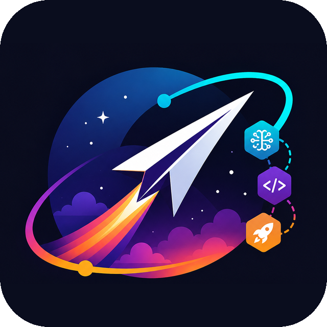
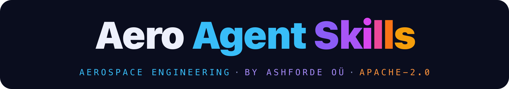
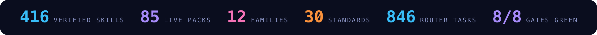
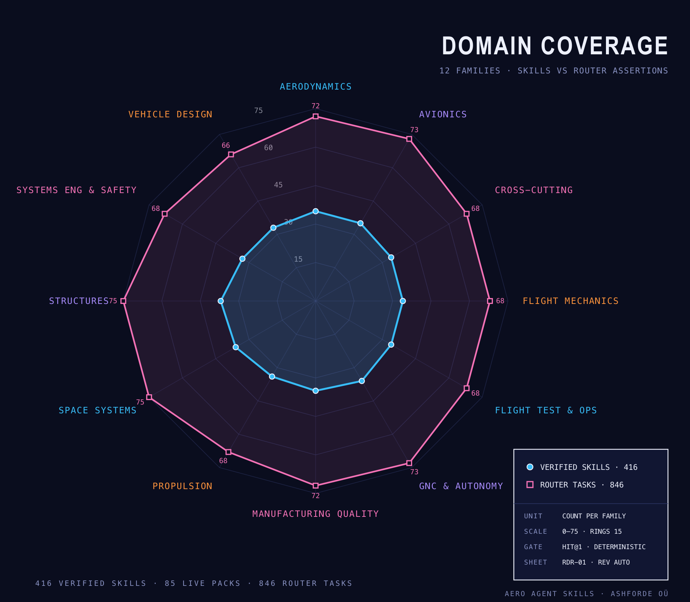
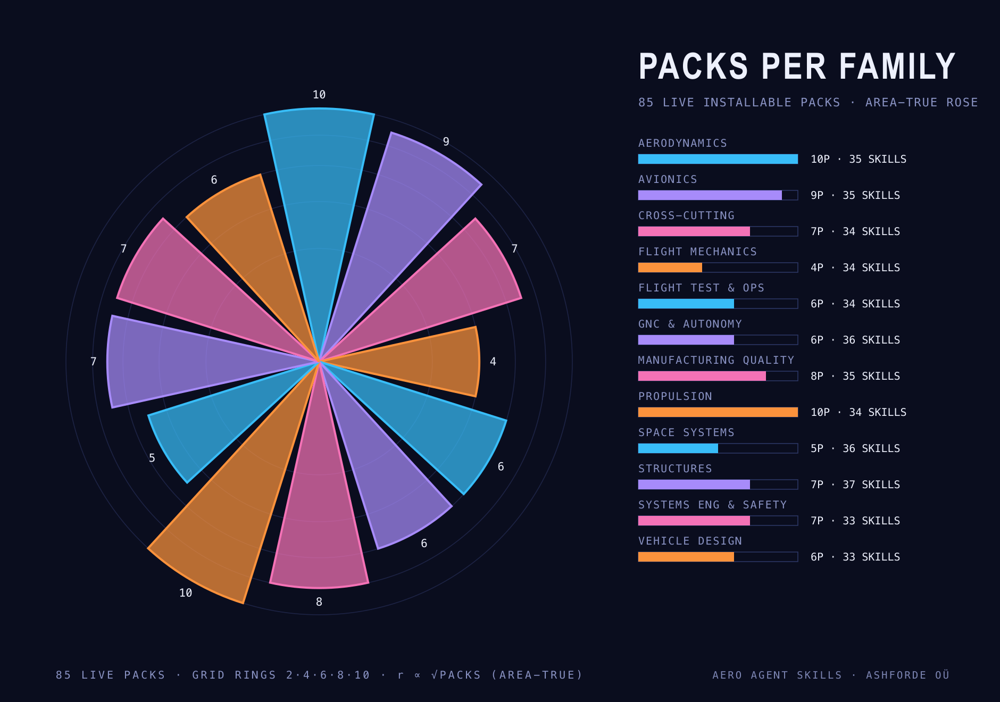
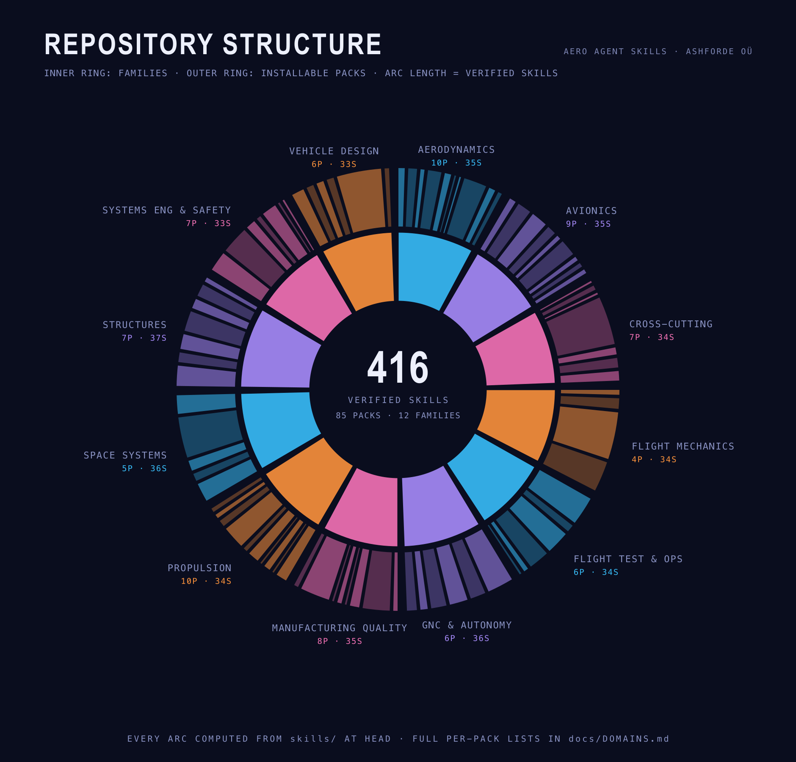
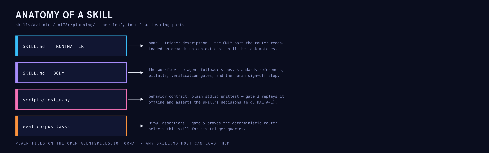
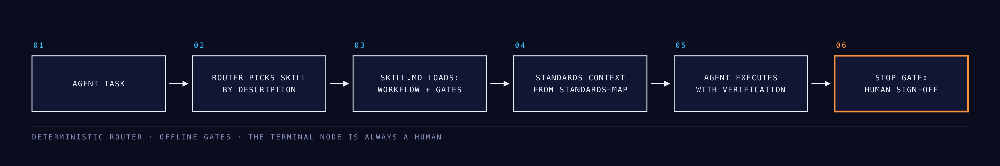
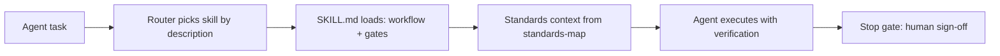
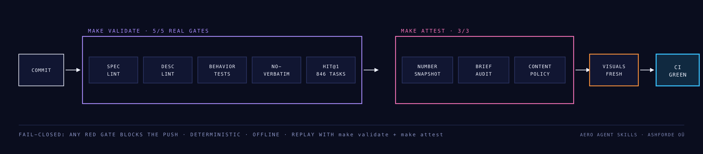

<p align="center">
  
</p>

<p align="center">
  
</p>

<p align="center">
  <strong>The aerospace knowledge layer for AI agents.</strong><br>
  Standards-mapped skills that give a coding agent the certification process — not just the acronyms.
</p>

<!-- gen:statline -->
<p align="center">
  
</p>
<!-- /gen:statline -->

<!-- gen:badges -->
<p align="center">
  <a href="skills/"></a>
  <a href="docs/DOMAINS.md"></a>
  <a href="docs/DOMAINS.md"></a>
  <a href="STANDARDS.md"></a>
  <a href="docs/harness-contract.md"></a>
  <a href="docs/harness-contract.md"></a>
  <a href="eval/"></a>
  <a href="https://agentskills.io"></a>
</p>
<p align="center">
  <a href="https://www.npmjs.com/package/aero-agent-skills"></a>
  <a href="packages/aero-agent-skills/"></a>
  <a href="docs/harness-integration.md"></a>
  <a href=".claude-plugin/"></a>
</p>
<!-- /gen:badges -->

<p align="center">
  <a href="#quick-start">Quick start</a> ·
  <a href="#for-humans">For humans</a> ·
  <a href="#for-agents">For agents</a> ·
  <a href="#compatibility">Compatibility</a> ·
  <a href="#the-standards-map">Standards map</a> ·
  <a href="#how-it-works">How it works</a> ·
  <a href="#roadmap">Roadmap</a> ·
  <a href="#faq">FAQ</a>
</p>

> **Works everywhere:** skills follow the open [agentskills.io](https://agentskills.io) spec — any SKILL.md host can load them. Install and use in **Claude Code, OpenAI Codex, Gemini CLI, Cursor, OpenCode, DeepSeek (via harness), GitHub Copilot, Kimi, Cline/Roo, Continue**, and 70+ more — or connect over **MCP** (JetBrains AI Assistant / Junie, Claude Desktop, VS Code, Windsurf) via the `aero-agent-skills` npm package. Verified per-harness details: [docs/harness-integration.md](docs/harness-integration.md).

---

Ask a general-purpose AI about DO-178C and you get a Wikipedia summary: the acronyms, none of the clauses. Aerospace engineering is standards-bound and evidence-driven. A number without a validation step is useless.

**Aero Agent Skills encodes the process** — when to use a standard, the workflow, the pitfalls, and the point where the agent must stop and let a human sign. Each skill is a `SKILL.md` on the open agentskills.io format: YAML frontmatter the router reads, a body the agent follows. Loaded on demand, no lock-in, works in any host that reads the format.

Every number and chart in this README is **generated from the tree at HEAD** by `make visuals` and CI fails if they drift — the same fail-closed philosophy as the skill gates. No hand-counted claims.

## Quick start

**Install everything — one command, any agent:**

```bash
npx skills add ashfordeOU/aero-agent-skills
```

**Try one skill without installing:**

```bash
npx skills use ashfordeOU/aero-agent-skills --skill avionics/do178c/planning | claude
```

**Or the npm CLI** — list, search, show, install, and the MCP server in one zero-dependency binary:

```bash
npm i -g aero-agent-skills            # or: npx aero-agent-skills <command>
aero-skills search "draft a PSAC for a DAL B system"
aero-skills install avionics/do178c --harness claude
```

Package: **[aero-agent-skills on npm](https://www.npmjs.com/package/aero-agent-skills)** (published by Ashforde OÜ).

**Or install the JetBrains IDE plugin** (AI Assistant + Junie integration, searchable skill router in the IDE):

- Marketplace: **[Aero Agent Skills on the JetBrains Marketplace](https://plugins.jetbrains.com/plugin/34041-aero-agent-skills)**
- In the IDE: **Settings → Plugins → Marketplace** → search `Aero Agent Skills` → Install
- After install, the plugin's MCP server serves `search_skills` / `get_skill` to AI Assistant and Junie with zero manual MCP config

**Or as an MCP server** — JetBrains AI Assistant / Junie, Claude Desktop, VS Code, Cursor, Windsurf, Gemini CLI, or any Model Context Protocol host. The `search_skills` tool is the same deterministic router the Hit@1 gate proves; `get_skill` streams the full SKILL.md:

```json
{
  "mcpServers": {
    "aero-agent-skills": { "command": "npx", "args": ["-y", "aero-agent-skills", "mcp"] }
  }
}
```

Publisher page: [npmjs.com/package/aero-agent-skills](https://www.npmjs.com/package/aero-agent-skills) (published by Ashforde OÜ). Per-host setup paths: [docs/harness-integration.md](docs/harness-integration.md).

**Or as a Claude Code plugin** — the twelve family routers load always-on (a few hundred tokens each) and pull leaf skills on demand:

```bash
claude plugin marketplace add ashfordeOU/aero-agent-skills
claude plugin install aero-agent-skills@aero-agent-skills
```

**Or copy a folder** — skills are just files:

```bash
git clone https://github.com/ashfordeOU/aero-agent-skills
cp -r aero-agent-skills/skills/avionics/do178c/planning ~/.claude/skills/
```

**You know it worked when** your agent drafts a DO-178C verification plan with DAL allocation and a "stop — human sign-off required" gate, instead of a Wikipedia summary.

## For humans

### The domain map

<!-- gen:overview -->
**416 verified skills** across **12 families** and **85 live sub-domain packs** — each one spec-linted, behavior-tested, and router-asserted against a **846-task Hit@1 corpus**. Every figure below is computed from the tree at HEAD; nothing is hand-counted.
<!-- /gen:overview -->

<p align="center">
  
</p>

<p align="center">
  
</p>

Full per-pack skill lists: **[docs/DOMAINS.md](docs/DOMAINS.md)**.

### What's inside

<p align="center">
  
</p>

The 12-family register — every count computed from the tree, regenerated on every change. Per-pack skill lists live in **[docs/DOMAINS.md](docs/DOMAINS.md)** so this table stays summary-only and the README does not grow with the library.

<!-- gen:family-table -->
| Family | Standard spine | Packs | Skills | Router tasks |
|---|---|---:|---:|---:|
| **Aerodynamics** | NACA TR-824 | 10 | 35 | 72 |
| **Avionics** | DO-178C / DO-254 / DO-160G | 9 | 35 | 73 |
| **Cross-cutting** | SEP-2640 | 7 | 34 | 68 |
| **Flight mechanics** | FAR-25 / CS-25 | 4 | 34 | 68 |
| **Flight test & operations** | FAR-25 / CS-25 | 6 | 34 | 68 |
| **GNC & autonomy** | ARP4754A | 6 | 36 | 73 |
| **Manufacturing quality** | AS9100 / AS9102 | 8 | 35 | 72 |
| **Propulsion** | FAR-33 | 10 | 34 | 68 |
| **Space systems** | ECSS | 5 | 36 | 75 |
| **Structures** | FAR-25 / CS-25 / MMPDS | 7 | 37 | 75 |
| **Systems engineering & safety** | ARP4754A / ARP4761A | 7 | 33 | 68 |
| **Vehicle design** | FAR-25 / CS-25 | 6 | 33 | 66 |
| **Total** | 30 standards mapped | **85** | **416** | **846** |
<!-- /gen:family-table -->

Full catalog: the [skills/](skills/) tree — every leaf is a verified skill. Per-pack tables: [docs/DOMAINS.md](docs/DOMAINS.md).

### See a skill

This is the artifact — one real skill, exactly as agents receive it:

<details>
<summary><code>avionics/do178c/planning</code> — SKILL.md (excerpt)</summary>

```yaml
name: planning
description: >-
  Plans DO-178C software certification for airborne systems or equipment.
  Use when planning software certification: determine the software level
  (DAL A-E), the planning documents required, and the lifecycle data.
  Don't use for hardware (DO-254) or tool qualification (DO-330).
```

The body walks the agent through: software level determination → the
planning artifacts (PSAC, SDP, SVP, SCMP, SQAP) → the review gates →
**where the agent must stop and let a human sign**.

</details>

Every skill ships three things: a trigger-optimized description the router
reads, a step-by-step workflow with verification gates, and a **behavior
contract test** that runs offline. `make validate` checks all of it.

<p align="center">
  
</p>

### The standards map

`standards-map.yaml` is the machine-readable source of truth; [STANDARDS.md](STANDARDS.md) is the human companion. **No other aerospace skills repo has this** — it is the moat:

| Standard | Domain | Status |
|---|---|---|
| DO-178C | Airborne software | gated, summary-not-copy |
| DO-254 | Airborne hardware | gated, summary-not-copy |
| DO-330 | Tool qualification | gated, summary-not-copy |
| DO-160G | Environmental qualification | gated, summary-not-copy |
| ARP4754A | Systems development | gated, summary-not-copy |
| ARP4761A | Safety assessment | gated, summary-not-copy |
| AS9100 | Quality management | gated, summary-not-copy |
| AS9102 | First article inspection | gated, summary-not-copy |
| MMPDS | Metallic materials data | gated, summary-not-copy |
| FAR-25 / CS-25 | Transport airworthiness | public |
| FAR-33 | Engine airworthiness | public |
| ARINC 429 | Avionics data bus | reference |
| ARINC 664 | AFDX network | gated, summary-not-copy |
| NAS 410 | NDT personnel | reference |
| ASME Y14.5 | GD&T | reference |
| ECSS | Space engineering | public |
| NACA TR-824 / TN-902 | Aerodynamics | public |
| MIL-STD-1553 | Data bus | reference |
| SEP-2640 | Skill delivery format | open spec |

Gated standards never appear verbatim anywhere in this repository — the no-verbatim gate enforces it.

## For agents

### Compatibility

Skills are plain `SKILL.md` folders on the open agentskills.io spec — any host that reads the format can load them. Verified per-harness (sources + exact commands in [docs/harness-integration.md](docs/harness-integration.md)):

| Harness | Skill root | Install |
|---|---|---|
| **Claude Code** | `~/.claude/skills/<name>/` or `.claude/skills/` | copy or symlink the skill folder; `claude plugin` for plugin packaging |
| **OpenAI Codex** | `.agents/skills/<name>/` | copy or symlink; consumes the root `AGENTS.md` automatically |
| **Gemini CLI** | `~/.gemini/skills/` or `.agents/skills/` | `gemini skills link <path>` |
| **Cursor** | `.cursor/skills/` (recursive walk) | copy or symlink |
| **OpenCode** | `.agents/skills/<name>/` | copy or symlink |
| **DeepSeek (via harness)** | `.agents/skills/` (DeepSeek Harness / dsh) | `npx @deepseek-ai/dsh web`; or any SKILL.md harness with DeepSeek as model (Cline, Continue, Deep Code) |
| **GitHub Copilot, Kimi, Cline/Roo, Continue** | `.agents/skills/` (cross-client convention) | any SKILL.md-capable agent with `.agents/skills/` support |
| **Hermes, OpenClaw** | profile skills dirs | native SKILL.md consumption |
| **JetBrains (AI Assistant / Junie)** | IDE plugin + MCP | **[Marketplace plugin 34041](https://plugins.jetbrains.com/plugin/34041-aero-agent-skills)** (Settings → Plugins → search `Aero Agent Skills`); or `npx -y aero-agent-skills mcp` in the IDE's MCP settings |
| **Claude Desktop, VS Code, Windsurf** | MCP | same one-line server in each host's MCP config |
| **Claude Code (plugin)** | plugin marketplace | `claude plugin marketplace add ashfordeOU/aero-agent-skills` |
| **Any agentskills.io host** | per-host root | copy the folder, done |

The `npx skills` CLI ([vercel-labs/skills](https://github.com/vercel-labs/skills)) installs into 70+ of these automatically; the repo's own `aero-skills install` (npm) flattens any selection into `claude`, `codex`, `gemini`, `cursor`, `opencode`, or a `--dest` of your choice — and qualifies folder names when a selection contains duplicate skill names.

### How it works

<p align="center">
  
</p>

<details>
<summary>Mermaid source</summary>



</details>

- **Discovery:** the router reads only the description (`what + when + trigger`) — loaded on demand, no context bloat
- **Determinism:** every skill's behavior contract runs offline; the router is deterministic
- **Proof:** `make validate` 5/5 + `make attest` 3/3, replayable by anyone
- **Format:** open agentskills.io spec, no lock-in, any host that reads the format

### Verify

You do not need to trust the badge. Replay the gates on the commit you are looking at:

<p align="center">
  
</p>

| Gate | What it checks | How to run |
|---|---|---|
| 1 spec lint | agentskills.io conformance + compliance flags | `make lint-spec` |
| 2 desc lint | description what + when + trigger | `make desc-lint` |
| 3 behavior tests | per-skill behavior contract, DAL A–E determination | `make pytest-contract` |
| 4 no-verbatim | standards text copyright control | `make no-verbatim` |
| 5 Hit@1 corpus | router selects the expected skill | `make hit1` |
<!-- gen:verify-extra -->
| — visuals fresh | charts + README numbers regenerate to zero diff | `make visuals-check` |
<!-- /gen:verify-extra -->

```bash
make validate       # 5/5 REAL gates, deterministic, offline
make attest         # 3/3: number snapshot, brief audit, content-policy sweep
make visuals-check  # charts + README numbers regenerate to zero diff
```

Verified means the full bar passes on the commit you are looking at. That is what "verified" means in this repository: nothing more. It is not certification, not approval, not airworthy.

## Roadmap

<!-- gen:roadmap -->
- **Shipped:** 416 verified skills in 85 packs across 12 disciplines, all gated by `make validate` (5/5) and `make attest` (3/3); distribution as an npm CLI + MCP server (`aero-agent-skills`, router parity proven on the full 846-task corpus) and Claude Code plugin packaging
- **Now:** deepening every live pack and opening new sub-domain packs on the same eval-gated pipeline — every addition lands with its behavior contract and router tasks
- **Later:** reference builds; marketplace listings; AI Department Operator packs
<!-- /gen:roadmap -->

## Contributing

Read [CONTRIBUTING.md](CONTRIBUTING.md) before opening a PR: one skill per PR, every contributor certifies their submission contains no controlled data and no verbatim standards text, every merge must pass `make validate` (5/5) and `make attest` (3/3).

## Security

Skills are folders that can carry scripts, and agent hosts execute what they load. Review the SKILL.md and any scripts before you install, the same way you would review any code dependency. Report vulnerabilities per [SECURITY.md](SECURITY.md).

## FAQ

[docs/FAQ.md](docs/FAQ.md) covers license, certification status, export control, what verified means, and affiliation. Short answers: Apache-2.0, not certified, not controlled as published, verified = replayable `make validate` 5/5 + `make attest` 3/3 on the commit you are looking at, not affiliated with RTCA, SAE, EASA, FAA, or any government.

<details>
<summary><b>Compliance notice</b></summary>

Aero Agent Skills is an open, unrestricted library of *civil aerospace engineering methodology* for AI agents, published by Ashforde OÜ (Estonia) under Apache-2.0. The content is educational: general engineering principles, processes, and tool-usage guidance. It is **not** ITAR/EAR-controlled technical data, and no proprietary standards text is reproduced. Standards are referenced and summarized only (see [STANDARDS.md](STANDARDS.md)). As published, this library falls within the EU dual-use "public domain" exclusion (Annex I General Technology Note, Regulation (EU) 2021/821). Users are solely responsible for their own compliance. **Not affiliated with or endorsed by** RTCA, EUROCAE, SAE International, IAQG, EASA, FAA, or any government.

</details>

## License

Apache-2.0. See [LICENSE](LICENSE) · [NOTICE](NOTICE) · [SECURITY.md](SECURITY.md) · [CONTRIBUTING.md](CONTRIBUTING.md) · [STANDARDS.md](STANDARDS.md) · [CODE_OF_CONDUCT.md](CODE_OF_CONDUCT.md)

Aero Agent Skills is built and maintained by **[Ashforde OÜ](https://ashforde.org)** (Estonia). Copyright © 2026 Ashforde OÜ.

---

<div align="center">

### ⭐ Stars are our telemetry

**Every star steers the flight plan — it decides which family gets the next authoring pass.**<br>
**If a skill saved you an afternoon, send one back.**

<a href="https://github.com/ashfordeOU/aero-agent-skills/stargazers"></a>

</div>
