# AeroSkills Domain Map

Machine-readable source of truth: `skills/` tree. This page is the human
companion — 12 families, 61 live sub-domain packs, 270 verified leaves
(as of 2026-09-01), target 73 packs × 20 = 1,460.

```mermaid
graph TD
    ROOT[AeroSkills]
    aerodynamics[aerodynamics]
    ROOT --> aerodynamics
    aerodynamics_airfoil[airfoil · 4]
    aerodynamics --> aerodynamics_airfoil
    aerodynamics_boundary_layer[boundary-layer · 1]
    aerodynamics --> aerodynamics_boundary_layer
    aerodynamics_cfd[cfd · 5]
    aerodynamics --> aerodynamics_cfd
    aerodynamics_drag_polars[drag-polars · 3]
    aerodynamics --> aerodynamics_drag_polars
    aerodynamics_ground_effects[ground-effects · 1]
    aerodynamics --> aerodynamics_ground_effects
    aerodynamics_high_lift[high-lift · 1]
    aerodynamics --> aerodynamics_high_lift
    aerodynamics_high_speed[high-speed · 7]
    aerodynamics --> aerodynamics_high_speed
    aerodynamics_wing_design[wing-design · 1]
    aerodynamics --> aerodynamics_wing_design
    avionics[avionics]
    ROOT --> avionics
    avionics_data_bus[data-bus · 3]
    avionics --> avionics_data_bus
    avionics_do160[do160 · 5]
    avionics --> avionics_do160
    avionics_do178c[do178c · 7]
    avionics --> avionics_do178c
    avionics_do254[do254 · 4]
    avionics --> avionics_do254
    avionics_far_cs25[far-cs25 · 2]
    avionics --> avionics_far_cs25
    avionics_flight_management[flight-management · 2]
    avionics --> avionics_flight_management
    cross_cutting[cross-cutting]
    ROOT --> cross_cutting
    cross_cutting_documentation[documentation · 2]
    cross_cutting --> cross_cutting_documentation
    cross_cutting_numerics[numerics · 12]
    cross_cutting --> cross_cutting_numerics
    cross_cutting_sep2640[sep2640 · 3]
    cross_cutting --> cross_cutting_sep2640
    cross_cutting_tolerancing[tolerancing · 2]
    cross_cutting --> cross_cutting_tolerancing
    cross_cutting_units_atmos[units-atmos · 4]
    cross_cutting --> cross_cutting_units_atmos
    flight_mechanics[flight-mechanics]
    ROOT --> flight_mechanics
    flight_mechanics_handling_qualities[handling-qualities · 2]
    flight_mechanics --> flight_mechanics_handling_qualities
    flight_mechanics_performance[performance · 13]
    flight_mechanics --> flight_mechanics_performance
    flight_mechanics_stability_control[stability-control · 7]
    flight_mechanics --> flight_mechanics_stability_control
    flight_test_operations[flight-test-operations]
    ROOT --> flight_test_operations
    flight_test_operations_envelope[envelope · 6]
    flight_test_operations --> flight_test_operations_envelope
    flight_test_operations_flutter[flutter · 3]
    flight_test_operations --> flight_test_operations_flutter
    flight_test_operations_performance[performance · 7]
    flight_test_operations --> flight_test_operations_performance
    flight_test_operations_planning[planning · 6]
    flight_test_operations --> flight_test_operations_planning
    flight_test_operations_stability[stability · 1]
    flight_test_operations --> flight_test_operations_stability
    gnc_autonomy[gnc-autonomy]
    ROOT --> gnc_autonomy
    gnc_autonomy_control[control · 8]
    gnc_autonomy --> gnc_autonomy_control
    gnc_autonomy_guidance[guidance · 5]
    gnc_autonomy --> gnc_autonomy_guidance
    gnc_autonomy_navigation[navigation · 4]
    gnc_autonomy --> gnc_autonomy_navigation
    gnc_autonomy_optimal_control[optimal-control · 2]
    gnc_autonomy --> gnc_autonomy_optimal_control
    gnc_autonomy_space[space · 3]
    gnc_autonomy --> gnc_autonomy_space
    manufacturing_quality[manufacturing-quality]
    ROOT --> manufacturing_quality
    manufacturing_quality_as9100[as9100 · 10]
    manufacturing_quality --> manufacturing_quality_as9100
    manufacturing_quality_as9102[as9102 · 4]
    manufacturing_quality --> manufacturing_quality_as9102
    manufacturing_quality_ndt[ndt · 8]
    manufacturing_quality --> manufacturing_quality_ndt
    manufacturing_quality_special_processes[special-processes · 1]
    manufacturing_quality --> manufacturing_quality_special_processes
    propulsion[propulsion]
    ROOT --> propulsion
    propulsion_axial_compressor[axial-compressor · 4]
    propulsion --> propulsion_axial_compressor
    propulsion_engine_airframe[engine-airframe · 1]
    propulsion --> propulsion_engine_airframe
    propulsion_gas_turbine_cycle[gas-turbine-cycle · 4]
    propulsion --> propulsion_gas_turbine_cycle
    propulsion_ramjet[ramjet · 2]
    propulsion --> propulsion_ramjet
    propulsion_rocket[rocket · 6]
    propulsion --> propulsion_rocket
    propulsion_turbofan[turbofan · 3]
    propulsion --> propulsion_turbofan
    propulsion_turboprop[turboprop · 2]
    propulsion --> propulsion_turboprop
    space_systems[space-systems]
    ROOT --> space_systems
    space_systems_adcs[adcs · 5]
    space_systems --> space_systems_adcs
    space_systems_ecss[ecss · 3]
    space_systems --> space_systems_ecss
    space_systems_orbit_mechanics[orbit-mechanics · 9]
    space_systems --> space_systems_orbit_mechanics
    space_systems_subsystems[subsystems · 5]
    space_systems --> space_systems_subsystems
    structures[structures]
    ROOT --> structures
    structures_composites[composites · 4]
    structures --> structures_composites
    structures_damage_tolerance[damage-tolerance · 4]
    structures --> structures_damage_tolerance
    structures_fatigue[fatigue · 5]
    structures --> structures_fatigue
    structures_fem[fem · 6]
    structures --> structures_fem
    structures_materials[materials · 4]
    structures --> structures_materials
    systems_engineering_safety[systems-engineering-safety]
    ROOT --> systems_engineering_safety
    systems_engineering_safety_arp4754a[arp4754a · 7]
    systems_engineering_safety --> systems_engineering_safety_arp4754a
    systems_engineering_safety_arp4761a[arp4761a · 9]
    systems_engineering_safety --> systems_engineering_safety_arp4761a
    systems_engineering_safety_mbse[mbse · 6]
    systems_engineering_safety --> systems_engineering_safety_mbse
    vehicle_design[vehicle-design]
    ROOT --> vehicle_design
    vehicle_design_conceptual[conceptual · 2]
    vehicle_design --> vehicle_design_conceptual
    vehicle_design_cost_estimation[cost-estimation · 3]
    vehicle_design --> vehicle_design_cost_estimation
    vehicle_design_mass_properties[mass-properties · 3]
    vehicle_design --> vehicle_design_mass_properties
    vehicle_design_mdo[mdo · 1]
    vehicle_design --> vehicle_design_mdo
    vehicle_design_sizing[sizing · 11]
    vehicle_design --> vehicle_design_sizing
    vehicle_design_structures_integration[structures-integration · 2]
    vehicle_design --> vehicle_design_structures_integration
```

*61 packs · 270 leaves rendered above.*

## aerodynamics

**8 packs · 23 skills**

| Pack | Skills | Count |
|---|---|---|
| `airfoil` | `airfoil-geometry`, `airfoil-optimization`, `airfoil-selection`, `xfoil-analysis` | 4 |
| `boundary-layer` | `boundary-layer-theory` | 1 |
| `cfd` | `cfd-convergence`, `cfd-mesh-generation`, `cfd-turbulence-modeling`, `panel-method`, `vortex-lattice-method` | 5 |
| `drag-polars` | `drag-polar`, `lift-curve-slope`, `parasite-drag` | 3 |
| `ground-effects` | `ground-effect` | 1 |
| `high-lift` | `high-lift-systems` | 1 |
| `high-speed` | `normal-shock`, `oblique-shock`, `prandtl-meyer`, `supercritical-airfoil`, `swept-wing-aerodynamics`, `transonic-similarity`, `wave-drag-area-rule` | 7 |
| `wing-design` | `wing-planform-design` | 1 |

## avionics

**6 packs · 23 skills**

| Pack | Skills | Count |
|---|---|---|
| `data-bus` | `arinc429-protocol`, `arinc664-afdx`, `mil-std-1553` | 3 |
| `do160` | `electrostatic-discharge`, `environmental-qualification`, `lightning-protection`, `power-input`, `radio-frequency-susceptibility` | 5 |
| `do178c` | `airworthiness-liaison`, `configuration-management`, `development`, `planning`, `software-testing`, `tool-qualification`, `verification` | 7 |
| `do254` | `configuration-management`, `hardware-planning`, `requirements-capture`, `verification` | 4 |
| `far-cs25` | `airworthiness`, `special-conditions` | 2 |
| `flight-management` | `flight-planning`, `vertical-navigation` | 2 |

## cross-cutting

**5 packs · 23 skills**

| Pack | Skills | Count |
|---|---|---|
| `documentation` | `engineering-margins`, `engineering-report` | 2 |
| `numerics` | `convergence-verification`, `eigenvalue-decomposition`, `fast-fourier-transform`, `finite-difference-derivatives`, `interpolation`, `least-squares-regression`, `matrix-operations`, `monte-carlo-sampling`, `numerical-integration`, `ode-solvers`, `root-finding`, `uncertainty-propagation` | 12 |
| `sep2640` | `skill-authoring`, `skill-delivery`, `skill-evaluation` | 3 |
| `tolerancing` | `position-tolerance-calc`, `tolerance-stackup` | 2 |
| `units-atmos` | `dimensional-analysis`, `isa-atmosphere`, `temperature-conversion`, `unit-conversion` | 4 |

## flight-mechanics

**3 packs · 22 skills**

| Pack | Skills | Count |
|---|---|---|
| `handling-qualities` | `cooper-harper-rating`, `pilot-induced-oscillation` | 2 |
| `performance` | `breguet-endurance`, `breguet-range`, `climb-performance`, `descent-performance`, `energy-height`, `glide-performance`, `landing-performance`, `oei-climb-gradient`, `specific-range`, `takeoff-performance`, `thrust-required`, `turn-performance`, `wind-effects` | 13 |
| `stability-control` | `aileron-reversal`, `control-surface-effectiveness`, `dynamic-stability`, `lateral-directional-stability`, `longitudinal-stability`, `spin-recovery`, `trim-analysis` | 7 |

## flight-test-operations

**5 packs · 23 skills**

| Pack | Skills | Count |
|---|---|---|
| `envelope` | `envelope-expansion`, `flight-loads-survey`, `load-factor-envelope`, `stall-characteristics-testing`, `structural-coupling-test`, `v-speeds` | 6 |
| `flutter` | `flutter-testing`, `ground-vibration-testing`, `limit-cycle-oscillation` | 3 |
| `performance` | `accelerate-stop-distance`, `climb-performance-flight-test`, `engine-flight-test`, `glide-flight-test`, `landing-distance-determination`, `stall-speed-determination`, `takeoff-distance-determination` | 7 |
| `planning` | `flight-test-data-reduction`, `flight-test-instrumentation`, `flight-test-planning`, `flight-test-safety`, `telemetry-data-acquisition`, `test-point-matrix-design` | 6 |
| `stability` | `dynamic-stability-flight-test` | 1 |

## gnc-autonomy

**5 packs · 22 skills**

| Pack | Skills | Count |
|---|---|---|
| `control` | `frequency-response-design`, `gain-scheduling`, `lead-lag-compensation`, `observer-design`, `pid-control-design`, `python-control-design`, `root-locus-design`, `state-space-analysis` | 8 |
| `guidance` | `command-to-line-of-sight`, `impact-point-prediction`, `midcourse-guidance`, `proportional-navigation`, `pursuit-guidance` | 5 |
| `navigation` | `dilution-of-precision`, `inertial-navigation`, `kalman-filter-design`, `navigation-frames` | 4 |
| `optimal-control` | `dymos-trajectory`, `lqr-design` | 2 |
| `space` | `attitude-dynamics`, `orbit-dynamics`, `rendezvous-phasing` | 3 |

## manufacturing-quality

**4 packs · 23 skills**

| Pack | Skills | Count |
|---|---|---|
| `as9100` | `calibration-control`, `corrective-action`, `counterfeit-prevention`, `document-control`, `measurement-systems-analysis`, `nonconformance-control`, `quality`, `risk-management`, `statistical-process-control`, `supplier-control` | 10 |
| `as9102` | `ballooning`, `delta-fai`, `fai-revalidation`, `first-article-inspection` | 4 |
| `ndt` | `eddy-current-inspection`, `liquid-penetrant-inspection`, `magnetic-particle-inspection`, `ndt-method-selection`, `radiographic-inspection`, `thermography`, `ultrasonic-inspection`, `visual-inspection` | 8 |
| `special-processes` | `special-process-qualification` | 1 |

## propulsion

**7 packs · 22 skills**

| Pack | Skills | Count |
|---|---|---|
| `axial-compressor` | `axial-compressor-stage`, `compressor-map`, `multi-stage-compressor`, `turbine-stage` | 4 |
| `engine-airframe` | `engine-airframe-integration` | 1 |
| `gas-turbine-cycle` | `combustor-design`, `gas-turbine-cycle`, `real-cycle-effects`, `regenerative-cycle` | 4 |
| `ramjet` | `ramjet-cycle`, `ramjet-inlet` | 2 |
| `rocket` | `combustion-chamber-design`, `nozzle-design`, `propellant-selection`, `rocket-sizing`, `rocket-staging`, `thrust-vector-control` | 6 |
| `turbofan` | `bypass-ratio-trade`, `turbofan-cycle`, `turbofan-off-design` | 3 |
| `turboprop` | `free-turbine`, `turboprop-cycle` | 2 |

## space-systems

**4 packs · 22 skills**

| Pack | Skills | Count |
|---|---|---|
| `adcs` | `attitude-control-sizing`, `attitude-determination-triad`, `magnetorquer-control`, `star-tracker`, `sun-pointing` | 5 |
| `ecss` | `software-engineering`, `software-verification`, `systems-engineering` | 3 |
| `orbit-mechanics` | `eclipse-time`, `ground-track-repeat`, `hohmann-transfer`, `keplerian-elements`, `lambert-transfer`, `orbital-decay`, `orbital-perturbations`, `satellite-coverage`, `sun-synchronous-inclination` | 9 |
| `subsystems` | `command-data-handling`, `communication-link-budget`, `power-thermal-budget`, `solar-array-sizing`, `thermal-design` | 5 |

## structures

**5 packs · 23 skills**

| Pack | Skills | Count |
|---|---|---|
| `composites` | `composite-bolted-joints`, `failure-criteria`, `laminate-stiffness`, `sandwich-panels` | 4 |
| `damage-tolerance` | `bird-strike`, `crack-growth`, `residual-strength`, `widespread-fatigue-damage` | 4 |
| `fatigue` | `goodman-diagram`, `load-spectrum-counting`, `miner-damage`, `notch-sensitivity`, `stress-life-curve` | 5 |
| `fem` | `buckling-analysis`, `calculix-linear`, `calculix-nonlinear`, `modal-analysis`, `plate-buckling`, `truss-analysis` | 6 |
| `materials` | `fracture-toughness`, `material-selection`, `mmpsd-allowables`, `ramberg-osgood` | 4 |

## systems-engineering-safety

**3 packs · 22 skills**

| Pack | Skills | Count |
|---|---|---|
| `arp4754a` | `derived-requirements`, `development-assurance-levels`, `requirements-allocation`, `requirements-traceability`, `systems-planning`, `validation`, `verification-planning` | 7 |
| `arp4761a` | `common-cause-analysis`, `failure-rate-estimation`, `fta-fmea`, `functional-hazard-assessment`, `markov-analysis`, `operating-support-hazard-analysis`, `particular-risk-analysis`, `safety-assessment`, `zonal-safety-analysis` | 9 |
| `mbse` | `n2-diagram`, `requirements-modeling`, `state-machine`, `sysml-modeling`, `systems-engineering`, `trade-study-analysis` | 6 |

## vehicle-design

**6 packs · 22 skills**

| Pack | Skills | Count |
|---|---|---|
| `conceptual` | `payload-range-diagram`, `tow-estimation` | 2 |
| `cost-estimation` | `life-cycle-cost`, `operating-cost`, `parametric-cost` | 3 |
| `mass-properties` | `cg-envelope`, `inertia-estimation`, `mass-budget` | 3 |
| `mdo` | `multidisciplinary-optimization` | 1 |
| `sizing` | `control-surface-sizing`, `engine-sizing`, `fuel-tank-sizing`, `fuselage-sizing`, `landing-gear-sizing`, `propeller-sizing`, `tail-sizing`, `tire-sizing`, `weight-estimation`, `wing-planform-sizing`, `ws-tw-trade` | 11 |
| `structures-integration` | `fuselage-skin-stringer`, `wing-box-sizing` | 2 |
